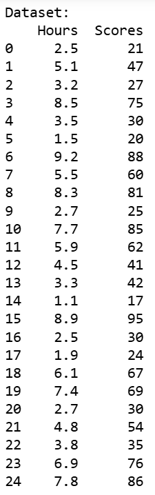
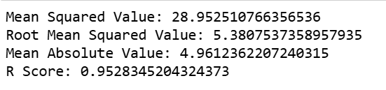

# Implementation-of-Simple-Linear-Regression-Model-for-Predicting-the-Marks-Scored

## AIM:
To write a program to predict the marks scored by a student using the simple linear regression model.

## Equipments Required:
1. Hardware – PCs
2. Anaconda – Python 3.7 Installation / Jupyter notebook

## Algorithm
1. Load the dataset into a DataFrame and explore its contents to understand the data structure.
2. Separate the dataset into independent (X) and dependent (Y) variables, and split them into training and testing sets.
3. Create a linear regression model and fit it using the training data.
4. Predict the results for the testing set and plot the training and testing sets with fitted lines.

## Program:
```
/*
Program to implement the simple linear regression model for predicting the marks scored.

#import libraries
import pandas as pd
import numpy as np
import matplotlib.pyplot as plt
from sklearn.metrics import mean_squared_error,mean_absolute_error,r2_score

#read csv file
df=pd.read_csv('student_scores.csv')

#displaying the content in datafile
print(f"Dataset:\n{df}")

# Segregating data to variables
a=list(df['Hours'])
x=np.array(a).reshape(-1,1)
b=list(df['Scores'])
y=np.array(b)

#splitting train and test data
from sklearn.model_selection import train_test_split
x_train,x_test,y_train,y_test=train_test_split(x,y,test_size=0.2,random_state=42)
#import linear regression model and fit the model with the data
from sklearn.linear_model import LinearRegression
model=LinearRegression()
model.fit(x_train,y_train)

#predicting values
yp=model.predict(x)

#plotting the graph for data
plt.figure(figsize=(7,4))
plt.scatter(x,y,color='blue',label="Actual Data")
plt.plot(x,yp, color='red', linewidth=2, label="Regression Line")
plt.xlabel("Hours Studied")
plt.ylabel("Marks Scored")
plt.title("Simple Linear Regression: Predicting Marks")
plt.legend()
plt.grid(True)
plt.show()

#find mae,mse,rmse
mse=mean_squared_error(y,yp)
rmse=np.sqrt(mse)
mae=mean_absolute_error(y,yp)
r2=r2_score(y,yp)
print(f"Mean Squared Value: {mse}")
print(f"Root Mean Squared Value: {rmse}")
print(f"Mean Absolute Value: {mae}")
print(f"R² Score: {r2}")

Developed by: Yash Chhajer V
RegisterNumber: 212225040498
*/
```

## Output:




## Result:
Thus the program to implement the simple linear regression model for predicting the marks scored is written and verified using python programming.
